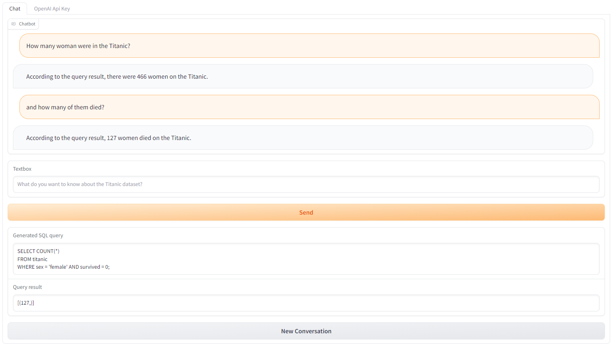
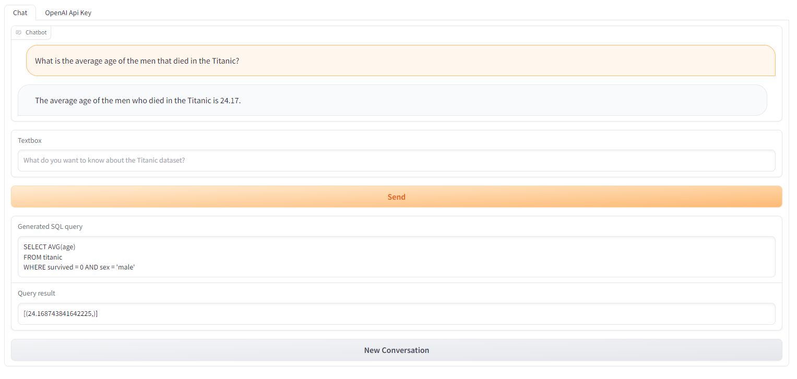
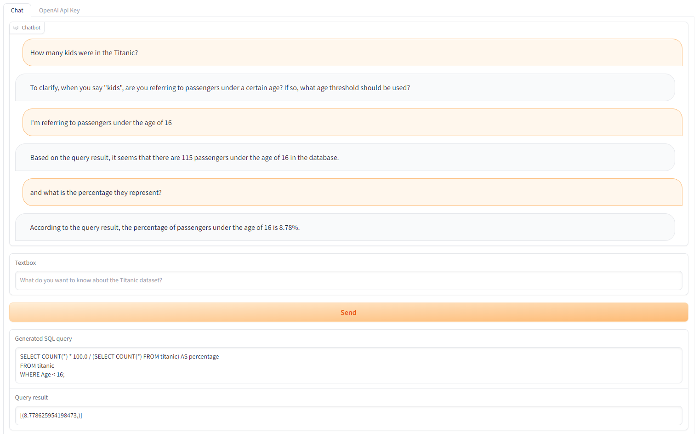

# Analyzing the Titanic dataset with a chatbot.

This repository contains the code to analyze the Titanic dataset using natural language.

Running the code will create a server with a chatbot ui, where you can ask questions about the Titanic dataset conversationally.

This app uses the ChatGPT to porcess the natural language, so, in order to use the app you will need to enter your OpenAI API key in the second tab in the app.

## How does the app work? (At a high level)

1. Once the user has written their request, ChatGPT writtes a SQL query that satisfies the request.
2. The app runs the SQL query in the database.
3. ChatGPT interprets the results, and writtes it back to the user.

## How to run the app.

Firs, install the requirements:
```
pip install -r requirements.txt
```

Then, run the `app.py` script:
```
python app.py
```
By default, the server will run in the port 7860.

## Examples

#### Example 1


#### Example 2


#### Example 3
